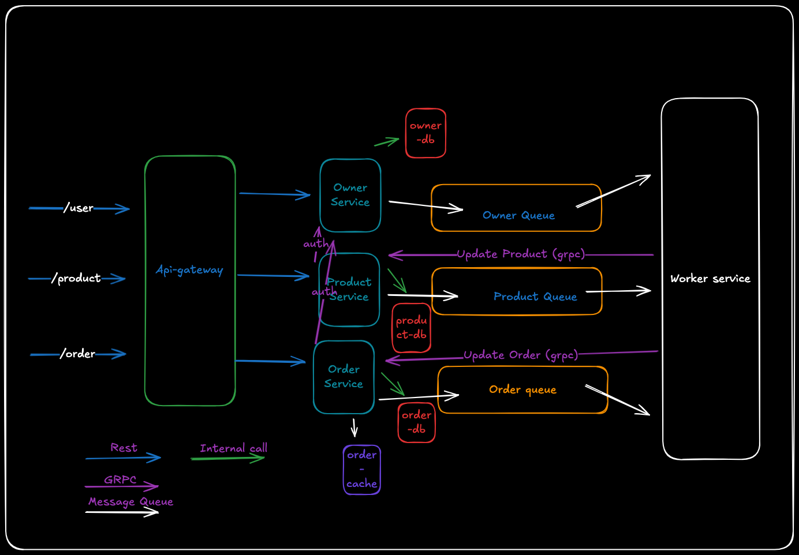

# Building a Microservices Architecture with NestJS

## Overview

This project involves creating a microservices architecture using NestJS that comprises three services: Owner, Products, and Order. Each service will interact with its own MongoDB database, and the communication between these services will be managed using RabbitMQ and gRPC protocols. The Order service will also implement a caching mechanism to optimize product data retrieval.

## Table of Contents

- Architecture Diagram
- [Microservices Overview]()
- [Requirements]()
- [Task Instructions]()
- [Deliverables]()
- [Architecture Diagram]()
- [Getting Started]()
- [Technologies Used]()
- [Contributing]()
- [License]()

## Architecture Diagram

## Microservices Overview

### 1. Owner Service

- Manages owner profiles.
- Updates product information when an owner updates their profile.

### 2. Products Service

- Manages product details.
- Updates orders when a product used in an order is changed.

### 3. Order Service

- Manages orders that include products.
- Caches product details to improve performance.

## Requirements

- **RabbitMQ** : Implement event-driven communication between services.
- **gRPC** : Implement RPC-based communication between services.
- **MongoDB** : Each service should have its own schema.
- **Caching** : Utilize a caching mechanism (e.g., Redis) in the Order service.

## Task Instructions

### 1. Setup the Microservices

- Create three NestJS applications: `OwnerService`, `ProductsService`, and `OrderService`.
- Use MongoDB for data storage and implement the required schemas and REST APIs.

### 2. Implement RabbitMQ Communication

- Configure RabbitMQ for event-driven communication.
- Emit and listen to events for owner and product updates.

### 3. Implement gRPC Communication

- Set up gRPC communication between the services.
- Define proto files and implement the necessary RPC methods.

### 4. Implement Caching in Order Service

- Use Redis or a similar caching service to cache product details.
- Implement logic to refresh the cache upon product updates.

### 5. Create a Diagram

- Develop a diagram that illustrates the relationships between services and their communication methods via RabbitMQ and gRPC.

## Deliverables

- Complete NestJS applications for `OwnerService`, `ProductsService`, and `OrderService`.
- MongoDB schemas and REST APIs for each service.
- Implementations of RabbitMQ and gRPC communication.
- A caching mechanism in the Order service.

## Getting Started

### Prerequisites

- Node.js (version X.X.X)
- MongoDB
- RabbitMQ
- Redis (for caching)

### Installation

1. Clone the repository:
   <pre class="!overflow-visible">

bash

<button class="flex gap-1 items-center py-1"><svg width="24" height="24" viewBox="0 0 24 24" fill="none" xmlns="http://www.w3.org/2000/svg" class="icon-sm"><path fill-rule="evenodd" clip-rule="evenodd" d="M7 5C7 3.34315 8.34315 2 10 2H19C20.6569 2 22 3.34315 22 5V14C22 15.6569 20.6569 17 19 17H17V19C17 20.6569 15.6569 22 14 22H5C3.34315 22 2 20.6569 2 19V10C2 8.34315 3.34315 7 5 7H7V5ZM9 7H14C15.6569 7 17 8.34315 17 10V15H19C19.5523 15 20 14.5523 20 14V5C20 4.44772 19.5523 4 19 4H10C9.44772 4 9 4.44772 9 5V7ZM5 9C4.44772 9 4 9.44772 4 10V19C4 19.5523 4.44772 20 5 20H14C14.5523 20 15 19.5523 15 19V10C15 9.44772 14.5523 9 14 9H5Z" fill="currentColor"></path></svg>Copy code</button>

<code class="!whitespace-pre hljs language-bash">git clone https://github.com/abdulazeez001/ecommerce.git
   cd microservices-nestjs
   </code>

</pre>
2. Navigate to each service directory (`OwnerService`, `ProductsService`, `OrderService`) and install dependencies:
   <pre class="!overflow-visible">

bash

<button class="flex gap-1 items-center py-1"><svg width="24" height="24" viewBox="0 0 24 24" fill="none" xmlns="http://www.w3.org/2000/svg" class="icon-sm"><path fill-rule="evenodd" clip-rule="evenodd" d="M7 5C7 3.34315 8.34315 2 10 2H19C20.6569 2 22 3.34315 22 5V14C22 15.6569 20.6569 17 19 17H17V19C17 20.6569 15.6569 22 14 22H5C3.34315 22 2 20.6569 2 19V10C2 8.34315 3.34315 7 5 7H7V5ZM9 7H14C15.6569 7 17 8.34315 17 10V15H19C19.5523 15 20 14.5523 20 14V5C20 4.44772 19.5523 4 19 4H10C9.44772 4 9 4.44772 9 5V7ZM5 9C4.44772 9 4 9.44772 4 10V19C4 19.5523 4.44772 20 5 20H14C14.5523 20 15 19.5523 15 19V10C15 9.44772 14.5523 9 14 9H5Z" fill="currentColor"></path></svg>Copy code</button>

<code class="!whitespace-pre hljs language-bash">cd owner-service
   yarn
   cd ../products-service
   yarn
   cd ../order-service
   yarn
   cd ../worker-service
   yarn
   </code>

</pre>
3. Set up environment variables for MongoDB, RabbitMQ, and Redis in each service as required.

### Running the Services

Start each service in separate terminal windows:

<pre class="!overflow-visible">

bash

<button class="flex gap-1 items-center py-1"><svg width="24" height="24" viewBox="0 0 24 24" fill="none" xmlns="http://www.w3.org/2000/svg" class="icon-sm"><path fill-rule="evenodd" clip-rule="evenodd" d="M7 5C7 3.34315 8.34315 2 10 2H19C20.6569 2 22 3.34315 22 5V14C22 15.6569 20.6569 17 19 17H17V19C17 20.6569 15.6569 22 14 22H5C3.34315 22 2 20.6569 2 19V10C2 8.34315 3.34315 7 5 7H7V5ZM9 7H14C15.6569 7 17 8.34315 17 10V15H19C19.5523 15 20 14.5523 20 14V5C20 4.44772 19.5523 4 19 4H10C9.44772 4 9 4.44772 9 5V7ZM5 9C4.44772 9 4 9.44772 4 10V19C4 19.5523 4.44772 20 5 20H14C14.5523 20 15 19.5523 15 19V10C15 9.44772 14.5523 9 14 9H5Z" fill="currentColor"></path></svg>Copy code</button>

<code class="!whitespace-pre hljs language-bash">cd owner-service
yarn start:dev

cd ../products-service
yarn start:dev

cd ../order-service
yarn start:dev

cd ../worker-service
yarn start:dev

or Run 
docker-compose -p ecommerce up
</code>

</pre>

## Technologies Used

- **NestJS** : A progressive Node.js framework for building efficient and scalable server-side applications.
- **MongoDB** : NoSQL database for data storage.
- **RabbitMQ** : Message broker for event-driven communication.
- **gRPC** : High-performance RPC framework.
- **Redis** : In-memory data structure store for caching.

## Documentation

1. OwnerService: [http://localhost:30000/api-docs](http://localhost:3000/api-docs)
2. ProductsService: [http://localhost:30001/api-docs](http://localhost:3001/api-docs)
3. OrderService: [http://localhost:30002/api-docs](http://localhost:3002/api-docs)

## Contributing

Contributions are welcome! Please feel free to submit a pull request or open an issue for any improvements or bug fixes.

## License

This project is licensed under the MIT License - see the [LICENSE]() file for details.
